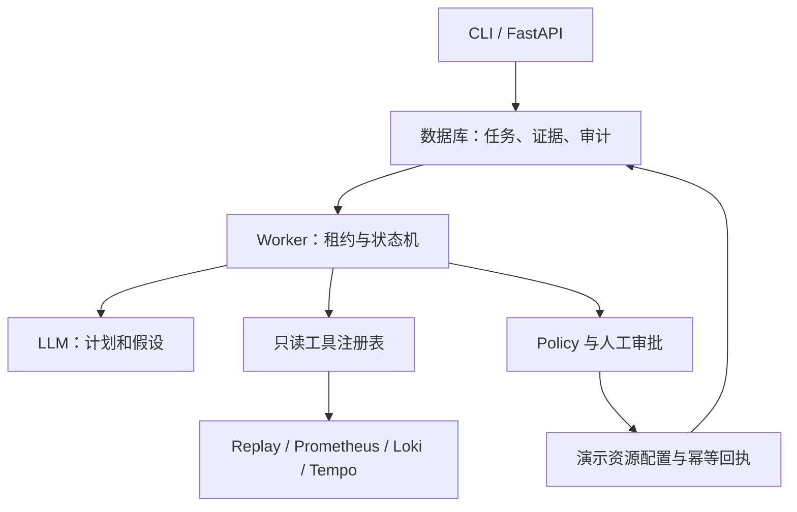

# AegisOps

**一个可恢复、带证据引用和人工审批的 Python 故障排查 Agent**

它接收故障告警，查询指标、日志、链路，形成结构化根因报告。状态保存在数据库里；模型只有提出调查与修复建议的能力，授权和执行由普通代码控制。

## 先跑起来


1. 安装 [Python 3.12](https://www.python.org/downloads/windows/)，安装时勾选 Python Launcher 和 Add Python to PATH。
2. 将工程完整解压到 `C:\Projects\aegisops`。不要直接在 ZIP 内运行。
3. 双击 `start-demo.cmd`，或在项目目录执行：

```powershell
powershell -NoProfile -ExecutionPolicy Bypass -File .\scripts\windows.ps1 setup
powershell -NoProfile -ExecutionPolicy Bypass -File .\scripts\windows.ps1 demo
```

随包附带 `wheelhouse/` 的 Windows x64 / CPython 3.12 依赖。此组合的 setup 使用本地依赖，不需要在线下载。Python 本身仍需提前安装。`ExecutionPolicy Bypass` 只作用于本次启动的 PowerShell 进程，不更改系统长期策略。

成功输出包含：`state: COMPLETED`、`cause: downstream_timeout`、`affected_service: inventory-service`。报告和事件保存在 `artifacts/local/<run_id>/`。每次运行的 ID 和耗时不同，这是正常现象。

**第一次学习请打开 [详细项目说明书](docs/project-guide.html)**，也有可编辑的 [Markdown 版](docs/project-guide.md)。安装问题看 [Windows 部署指南](docs/windows.md)。

## 项目的实际重点

- 显式状态机、数据库租约、fencing token、步骤检查点和崩溃恢复。
- 五个具有输入约束的只读工具，超时、有限重试、持久化预算、证据去敏。
- 根因必须引用真实 Evidence ID，高置信度要求不同信号类型；不够就回答证据不足。
- viewer/operator 权限、精确动作哈希审批、资源版本前置条件、事务内幂等修复。
- 审计哈希链与 10 个可复现的 clean/noisy/adversarial 场景。

采用自定义、小规模编排，便于看清后端一致性边界。没有依赖 LangGraph、CrewAI 或多角色 Agent。Fake Provider 是公开规则实现的测试替身。

## 架构



原生模式用 SQLite；Docker 模式用 PostgreSQL。两者复用 SQLAlchemy async 仓储、状态机和策略。SQLite 方便学习，不能用其测试结果代替 PostgreSQL 并发验证。

## 安全、恢复与证据

Tool 输入只接受两个已知服务和有限时间窗口，不接受任意 URL、SQL、shell 或文件路径。遥测先去敏、裁剪，再作为不可信数据传给模型。扫描器只能发现部分注入模式；真正的执行边界是工具白名单和代码策略。

审批绑定 run ID、动作参数哈希、期限和操作者；执行前再次检查资源 revision。修复只修改本演示的数据库资源配置，不操作宿主机服务或生产基础设施。两个动作是关闭演示故障和将演示版本回退到 v1。

状态更新和审计在同一事务中提交。租约过期后新 worker 取得更大的 fencing token，旧 worker 的写入被拒绝。读操作可能在中断后重试；演示修复的状态与回执同事务提交。**数据库内幂等不等于外部副作用 exactly once。**

Evidence 保存来源、查询范围、脱敏摘录与内容哈希。引用校验能识别伪造 ID 和部分资源不匹配，但不能证明“模型解释的因果关系一定正确”。审计哈希链也不能对抗拥有数据库重写权限的攻击者。

## 评测

```powershell
.\.venv\Scripts\python.exe -m aegisops eval
.\.venv\Scripts\python.exe -m pytest -q
```

实测结果在 [评测报告](artifacts/eval/latest/report.md) 和 `summary.json`。当前 10 个合成场景，Agent、Single Shot、Simple Rule 均为 10/10。Agent 平均 9.4 次工具调用，两个基线均为 9 次。**这批样本不能支持“比基线更准确／更快”的结论。**

两个基线都读取两个服务的固定遥测集合；Agent 通过验证阶段跟进依赖。Fake 模式 token/cost 为 0。真实模型、Windows 现场运行和 Docker live 栈验证状态见 [验收记录](docs/verification.md)，未运行的项目明确标为 NOT_MEASURED。

## 启动 API 与 Worker

两个 PowerShell 窗口都进入项目根目录：

```powershell
# 窗口一
.\.venv\Scripts\python.exe -m aegisops api
# 窗口二
.\.venv\Scripts\python.exe -m aegisops worker
```

打开 [Swagger](http://127.0.0.1:8000/docs)，点击 Authorize，填入 `.env` 中 `AEGIS_VIEWER_TOKEN` 的值。不要连同变量名一起粘贴。Token 为本地初始化随机生成，不要上传 `.env`。

依次调用：

```http
POST /incidents
{"title":"Checkout latency alert","service":"order-service","scenario":"downstream_timeout"}

POST /incidents/{incident_id}/investigate
GET /runs/{run_id}
GET /runs/{run_id}/report
GET /runs/{run_id}/events
```

API 只负责入队，后台需要 worker。最简单的 `demo-replay` 已内置临时 worker，因此不用开两个窗口。

## 两个面试演示

```powershell
# 真正启动并中断子进程，等待租约过期后恢复
.\.venv\Scripts\python.exe -m aegisops demo-crash-recovery
# 日志中包含间接注入与演示 canary
.\.venv\Scripts\python.exe -m aegisops demo-replay --scenario prompt_injection
```

审批演示：`demo-replay --remediate` 会停在 `WAITING_APPROVAL`；在 Swagger 切换 operator token，查看 `GET /approvals` 后审批，并保持独立 worker 运行。CLI 不会自动审批。

## PostgreSQL / Docker live 模式

Windows 需要 Docker Desktop 的 Linux containers 模式。关闭占用 8000 端口的原生 API，再执行：

```powershell
.\.venv\Scripts\python.exe scripts\configure_docker.py --live
docker compose --profile live up -d --build --wait
.\.venv\Scripts\python.exe scripts\live_demo.py
```

该模式运行 PostgreSQL、API、Worker、两个 demo 服务和四个观测组件；migration 是一次性容器。端口仅绑定 `127.0.0.1`，故障控制还需要独立 demo token。首次需要联网拉取镜像。完整说明见 `docs/windows.md`。

## 接真实模型

编辑 `.env`，重启 worker：

```dotenv
AEGIS_PROVIDER=openai
AEGIS_LLM_BASE_URL=https://your-provider.example/v1
AEGIS_LLM_MODEL=your-available-model
AEGIS_LLM_API_KEY=your-key
```

这里的 `openai` 指 Chat Completions 兼容协议，使用 httpx，不依赖厂商 SDK。服务端必须支持 JSON mode、`max_tokens`、`temperature` 和 usage 字段；不保证兼容所有推理模型或 Responses-only 接口。默认 API 地址只是配置值，不能在没有凭据时直接调用。启用真实模型会把脱敏遥测发送到你配置的供应商；测试仅验证 HTTP 协议模拟响应，未调用付费模型。

## 取舍、限制

- 为 Windows 增加原生 SQLite 路线，同时保留 prompt 要求的 PostgreSQL。
- 写操作缩减为两个同数据库内的演示动作，未提供任意外部修复执行器。
- 修复后验证配置确实变化；报告明确保留业务恢复状态 `NOT_MEASURED`，不冒充流量恢复验证。
- 未实现 MCP 暴露层、SSE、多租户、OIDC、分布式全局限流或生产熔断器。
- OTel 每次状态处理生成 span，通过 run.id 关联；不是一个跨进程持续打开的长 trace。
- 数据集小、人工合成、和 Fake 规则共同设计，评测主要证明回归可复现。


## 参考项目

设计参考了 [HolmesGPT](https://github.com/HolmesGPT/holmesgpt)、[agentgateway](https://github.com/agentgateway/agentgateway)、[Microsoft MCP Gateway](https://github.com/microsoft/mcp-gateway)、[AgentLedger](https://github.com/yaogdu/AgentLedger)、[AgentOps-Bench](https://github.com/kunwarshivam/agentops-bench)、[OTel SRE-Copilot](https://github.com/Wassbdr/otel-sre-copilot)。参考边界、核查日期与没有引入的部分写在 [design-notes](docs/design-notes.md)。没有复制这些项目的实现。

