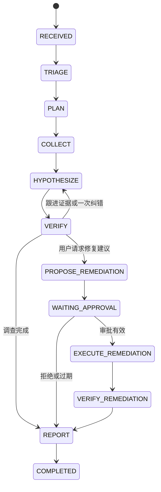

# 架构与模块边界

## 控制流程

API 创建 Incident，investigate 在事务中创建唯一 Run。worker 通过数据库队列 claim 任务，持有 lease 和 fencing token，每次推进一个显式状态。外部 I/O 不发生在长期数据库事务里；先记预算／调用开始，再调用工具，最后带租约保护提交结果。

错误／取消另进入 PARTIAL、FAILED、CANCELLED；瞬时错误留在原状态，按 next_at 有限重试。等待审批不会占用 worker 租约。相同 run 的所有写入先锁定 Run 行，因此审计链头不会被两个事务同时推进。

## 目录职责

| 位置 | 职责 | 不应放进来的逻辑 |
|---|---|---|
| `api/app.py` | HTTP 路由、角色、入队 | 直接执行 LLM 或修复 |
| `domain.py` | 状态、输入／输出 schema、错误类别 | 数据库连接 |
| `persistence/` | 表、事务、claim、fence、审计写入 | prompt |
| `runtime/worker.py` | 状态推进、预算、重试、heartbeat | 任意 shell |
| `tools/` | 白名单参数、I/O、输出去敏、证据 | 授予模型写权限 |
| `llm/providers.py` | provider Protocol、Fake 和 HTTP 适配器 | 审批判定 |
| `security/` | redaction、grounding、policy、审批执行 | 相信模型的授权声明 |
| `eval/` | 场景、基线、评分、artifact | 将 ground truth 提供给 provider |

`data/scenarios/` 位于包内，所以安装 wheel 后仍可访问。`fixtures_dir` 默认由包路径确定，不依赖绝对机器路径。

## 事务边界

读调用：持久化 started/预算 → 事务外 I/O → 带 fence 保存 Evidence 和成功调用记录。若 I/O 成功但保存前崩溃，只读请求可以再次执行；预算不会被重置。成功 Evidence 按 run + phase + 参数 fingerprint 缓存。

修复：锁 Run → 检查现有回执 → 锁 demo resource → 校验审批和 revision → 更新资源 + 写回执 + 写审计 → commit。两个不同 run 更新同一 revision，只有第一个能通过。

数据库事件没有发送到消息队列。本地持久化审计是 outbox-like 的起点；未来应加入发布状态与 dispatcher，不能把数据库事务与消息发送假设成一个原子操作。

## If the control plane were rewritten in Go

适合改写：FastAPI 路由对应 `net/http`/Gin；Repository 对应显式事务接口；Worker 对应 goroutine + context cancellation；lease/fencing 为数据库条件更新；Policy 为纯函数；Tool Registry 对应 typed interface；审计哈希使用标准库。

可留在 Python：LLM provider、prompt、数据处理和 eval。边界可通过 HTTP JSON 或进程队列连接。迁移时首先固定 domain schema、状态枚举和事务语义，不要以“把 Python 逐行翻译成 Go”为目标。

